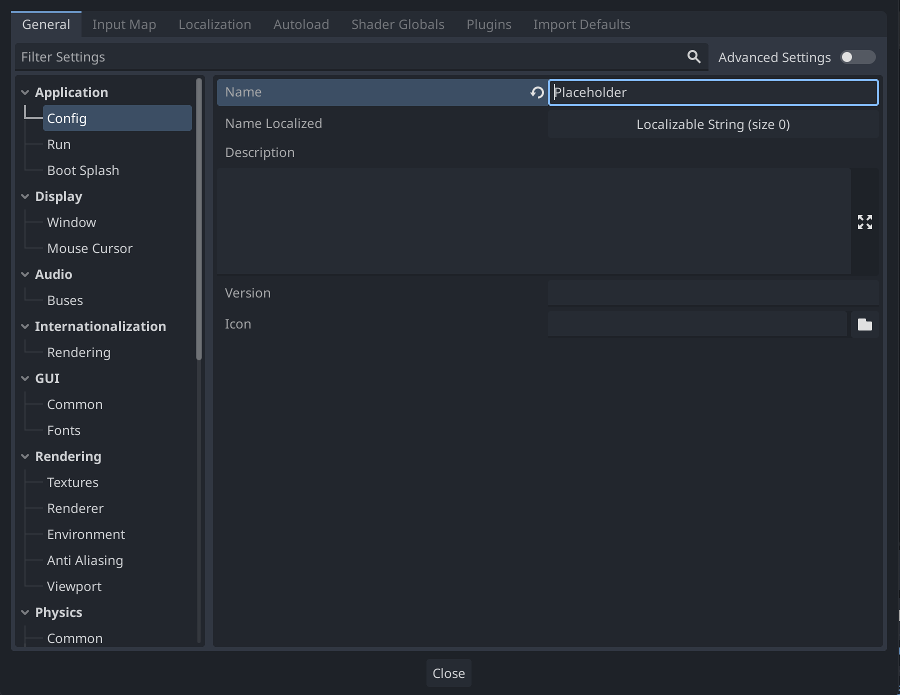
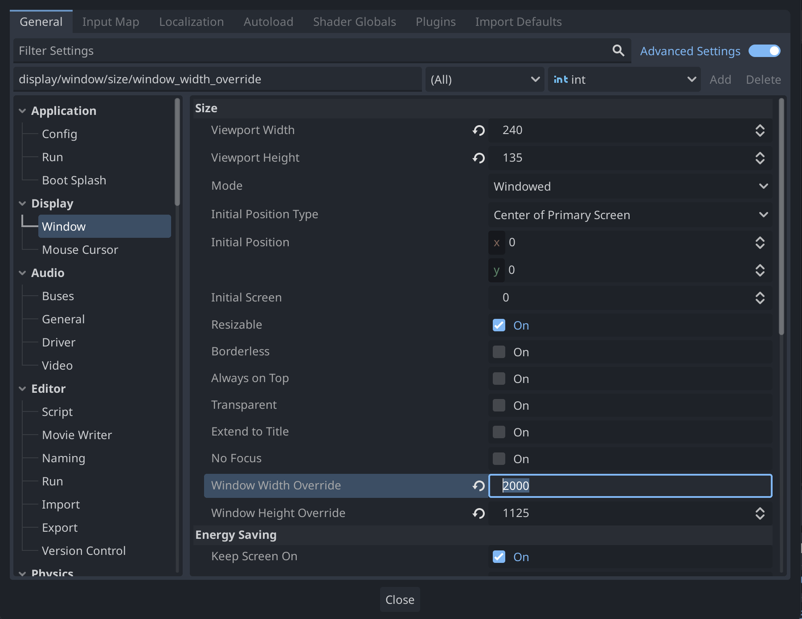
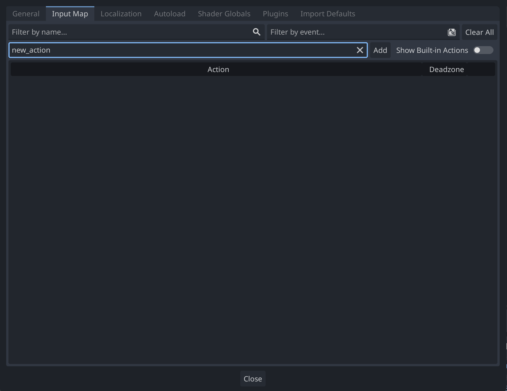
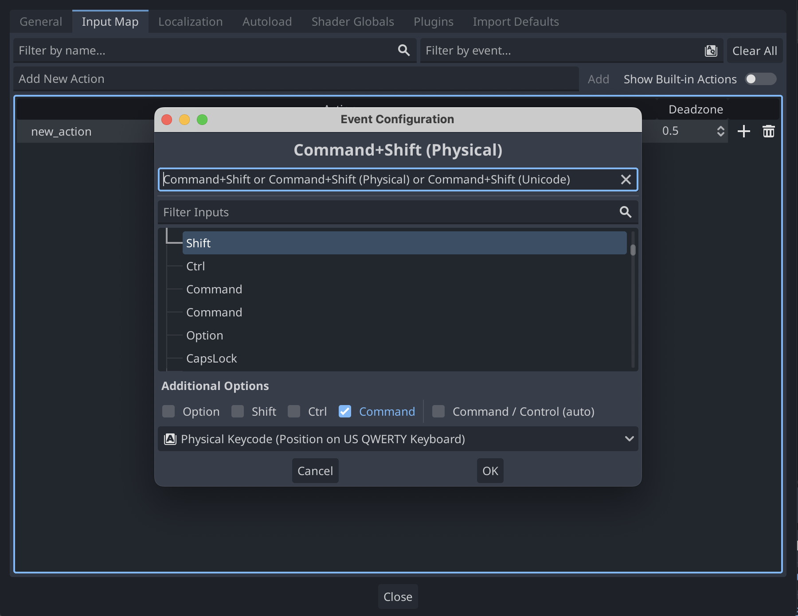

# 0 - Project Setup

To configure a Godot project, go to `Project -> Project Settings` in the top menu bar

## Renaming Project

Change the project's name, description, and icon under `General -> Application -> Conflig` in `Project Settings`.

## Resizing Game

To change the default size of the game window, head to `General -> Window` and change `Window Height Override` and `Window Width Override`. (NOTE: These options only appear after you turn on `Advanced Settings`)

## Configuring Controls

Add keybindings under `Input Map` in `Project Settings`. Add a new input action by typing a name for it in `Add New Action` and pressing `Add` or [Return].

After the input action is created, bind a key to it by pressing the plus icon and either pressing the key you want on your keyboard or searching for it in the menu.

You can add as many keybinds to an action as you want, and multiple different actions can share keybinds. This input action can be refrenced in code by the name you set at the start.
