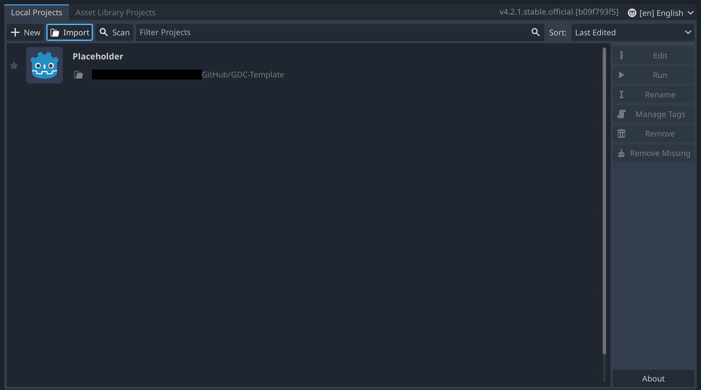
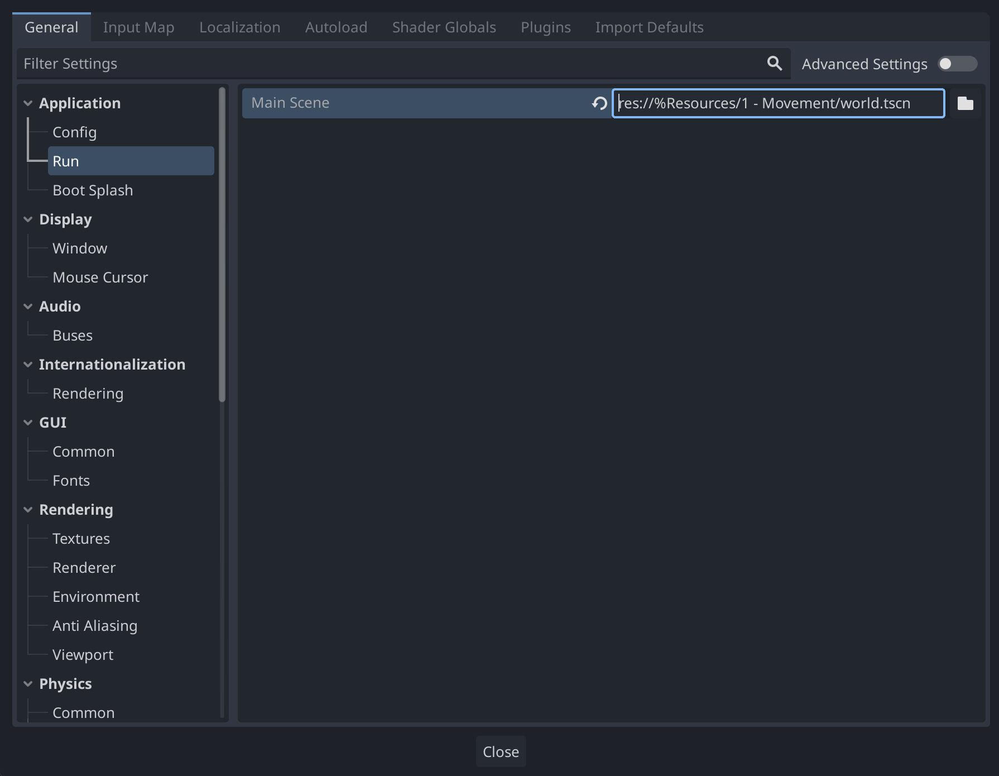

# 0 - Project Setup

## Importing Project

After downloading or cloning the repository from [Github](https://github.com/RecoilGaming/GDC-Template/tree/main), extract it into any folder on your computer and import it into Godot using the import button.

## Renaming Project

To configure a Godot project, go to `Project -> Project Settings` in the top menu bar

Change the project's name, description, and icon under `General -> Application -> Conflig` in `Project Settings`.

## Resizing Game

To change the default size of the game window, head to `General -> Window` and change `Window Height Override` and `Window Width Override`. (NOTE: These options only appear after you turn on `Advanced Settings`)

## Configuring Controls

Add keybindings under `Input Map` in `Project Settings`. Add a new input action by typing a name for it in `Add New Action` and pressing `Add` or [Return].

After the input action is created, bind a key to it by pressing the plus icon and either pressing the key you want on your keyboard or searching for it in the menu.

You can add as many keybinds to an action as you want, and multiple different actions can share keybinds. This input action can be refrenced in code by the name you set at the start.

## Create a Scene

For either a 2D or 3D scene, click the corresponding buttons to create a root node. You can worry about UI later.

The name of the scene doesn't matter, but you can name it something like `Main` or `World` to make it more obvious what the scene is.

Now, click the run button (the triangle thing in the top right) and press "Select Current" to set your scene as the one that is displayed when the game is run.

This main scene can be easily changed later  under `Application -> Run`.

