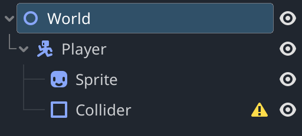

# 1 - Player Movement

## Creating the Player

To add a node to your scene, right-click the root (main) node in your scene and press `Add Child Node`. For the player, we will be using `CharacterBody2D`. which we will rename to `Player` for organizational purposes.

Under the `Player` node, create a `Sprite2D` (for displaying the player sprite), and a `CollisionShape2D` (to detect collisions later on). You may also rename these for organization.

Your scene tree should look like the following (possibly with different node names):

```
World (Node2D)
└─ Player (CharacterBody2D)
   ├─ Sprite (Sprite2D)
   └─ Collider (CollisionShape2d)
```



## Adding a Collider

Next up, you may notice that the collider has a concerning warning symbol next to it. This is because it has no defined shape! To fix this, select the `CollisionShape2D` in the hierarchy and add a shape to it in the inspector (right sidebar) .


For the purpose of this project, we will use a `RectangleShape2D`, but the other basic shapes also work:

```
CircleShape2D - Fastest collider, but needs to be a circle

CapsuleShape2D - Slightly slower, but allows for more freedom of shape

RectangleShape2D - Slower than the other two, but allows for sharp corners

PolygonShape2D (Convex/Concave) - Much slower than the others; Only use when needed
```

If you run the game right now, you will notice that there is no player to be seen! This is because the player doesn't have a sprite yet.

## Adding a Sprite

To add a sprite to your player, slick to the `Sprite2D` in the hierarchy and navigate to the `Texture` field. This time, however, we can't just create a sprite on the spot.


If you have your own sprite ready, import it by dragging it into the `FileSystem` tab near the bottom left corner of the editor. It should automatically import, after which you can move it to the appropriate folder.

If not, you can use the provided sprite under the `0 - Setup` folder linked [HERE](../0%20-%20Setup/player.png).

After obtaining a sprite, drag it into the `Texture` field on the `Sprite2D` to put it in. If you clicked off of the `Sprite2D`, just click on it again in the hierarchy.


At this point, you should be able to see your sprite after running the game, although it will be in the top left corner.

## Possible Issues

Cannot see sprite? Make sure the `Transform -> Position` fields on EVERY node related to the player is set to (0, 0).

Pixel art is blurry? Change the sprite's `CanvasItem -> Texture -> Filter` field to be `Nearest` instead of `Inherit`.


## Saving the Player Scene

This section is optional but highly recommended if you don't want your project to be extremely messy.

At this point, we can save the player as a custom scene seperate from the main one. This can be done simply by right-clicking on the player and selecting `Save Branch as Scene`.


This will prompt you for the location where you want to save the player scene. Select your `Characters -> Player` folder and select `Save`.

You will notice that the hierarchy under the `Player` node has dissapeared and that a new icon has appeared next to  it. Clicking this icon will direct you the the `Player` scene, which is contained within this `Player` node.


